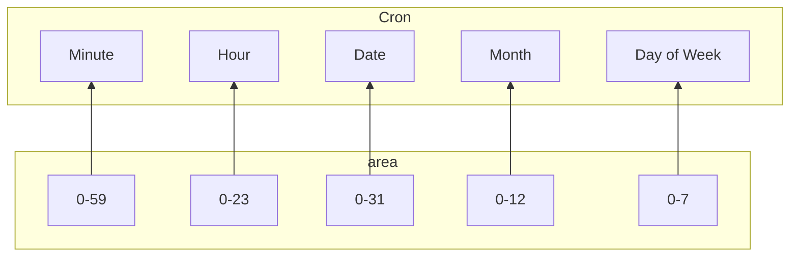

```mermaid
graph BT;
subgraph Cron
    Minute
    Hour
		Date
    Month
    D[Day of Week]
end

subgraph area
	direction LR
		minute[0-59] --> Minute
		hour[0-23] --> Hour
		mo[0-12] --> Month
		date[0-31] -->Date
		d[0-7] --> D
end

```

:::tip
* `*` 表示都匹配
:::