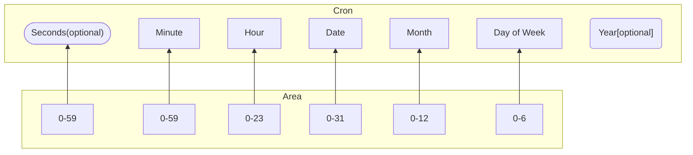

```mermaid
graph BT;
subgraph Cron
    Seconds(["Seconds(optional)"])
    Minute
    Hour
		Date
    Month
    D[Day of Week]
		Year("Year[optional]")
end

subgraph Area
	direction LR
	  seconds[0-59] --> Seconds
		minute[0-59] --> Minute
		hour[0-23] --> Hour
		mo[0-12] --> Month
		date[0-31] -->Date
		d[0-6] --> D
end

```

:::tip
* `*` 表示都匹配

`分点号月周` 几分几点 几号几月 周几

年月日， 小时分钟秒， 的倒序， 首尾可以忽略
:::