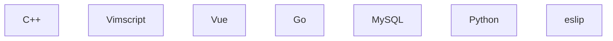
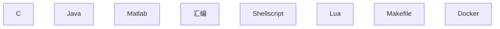
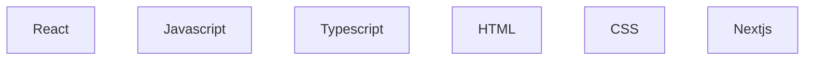
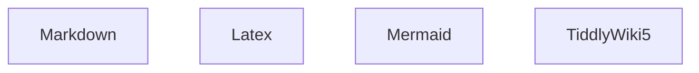

:::abstract
接触过的语言, 不限编程。
:::

## 了解

```mermaid dark
graph TD;
C++
Vimscript
Vue
Go
MySQL
Python
eslip
```

## 入门级

```mermaid forest
graph
C
Java
Matlab
汇编
Shellscript
Lua
Makefile
Docker
```

## 熟悉

```mermaid neutral
graph
React
Javascript
Typescript
HTML
CSS
Nextjs
```

## 写作工具

```mermaid
graph
Markdown
Latex
Mermaid
TiddlyWiki5
```