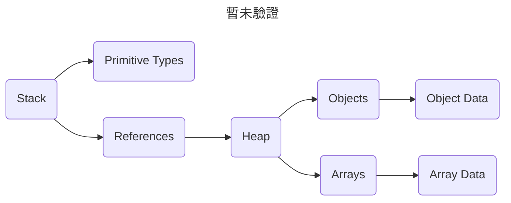

```mermaid
---
title: 暫未驗證
---
graph LR;
    栈(Stack) --> 基本类型(Primitive Types);
    栈(Stack) --> 指针(References);
    指针(References) --> 堆(Heap);
    堆(Heap) --> 对象(Objects);
    堆(Heap) --> 数组(Arrays);
    对象(Objects) --> 对象数据(Object Data);
    数组(Arrays) --> 数组数据(Array Data);
```
* js 由于变量作用域的原因, 不存在真正意义上的函数重载
* 基本数据类型(string, number, boolean, symbol, null, undefined)在栈上, 引用数据类型在堆上.