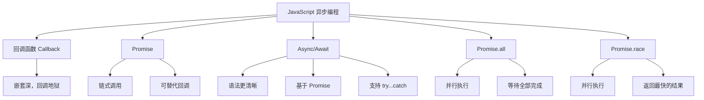

JavaScript 的异步编程主要有以下几种方式：  

## 1. **回调函数（Callback）**  
回调函数是最早期的异步处理方案，但容易导致“回调地狱”。  

```js
function asyncOperation(callback) {
  setTimeout(() => {
    console.log("任务完成");
    callback();
  }, 1000);
}

asyncOperation(() => {
  console.log("回调执行");
});
```

### **回调地狱**
当多个异步操作相互依赖时，代码会嵌套得很深，可读性差：  

```js
function step1(callback) {
  setTimeout(() => {
    console.log("步骤 1 完成");
    callback();
  }, 1000);
}

function step2(callback) {
  setTimeout(() => {
    console.log("步骤 2 完成");
    callback();
  }, 1000);
}

function step3(callback) {
  setTimeout(() => {
    console.log("步骤 3 完成");
    callback();
  }, 1000);
}

// 嵌套调用
step1(() => {
  step2(() => {
    step3(() => {
      console.log("所有步骤完成");
    });
  });
});
```

---

## 2. **Promise**
`Promise` 提供了更清晰的方式来处理异步操作，避免了回调地狱。  

```js
function asyncOperation() {
  return new Promise((resolve, reject) => {
    setTimeout(() => {
      console.log("任务完成");
      resolve("成功返回结果");
    }, 1000);
  });
}

asyncOperation().then((result) => {
  console.log("Promise 结果:", result);
});
```

### **Promise 链式调用**
可以通过 `.then()` 进行链式调用，提高可读性：

```js
function step1() {
  return new Promise((resolve) => {
    setTimeout(() => {
      console.log("步骤 1 完成");
      resolve();
    }, 1000);
  });
}

function step2() {
  return new Promise((resolve) => {
    setTimeout(() => {
      console.log("步骤 2 完成");
      resolve();
    }, 1000);
  });
}

function step3() {
  return new Promise((resolve) => {
    setTimeout(() => {
      console.log("步骤 3 完成");
      resolve();
    }, 1000);
  });
}

step1()
  .then(step2)
  .then(step3)
  .then(() => {
    console.log("所有步骤完成");
  });
```

---

## 3. **Async/Await**
`async/await` 是 `Promise` 的语法糖，让代码看起来更同步化，可读性更好。  

```js
function asyncOperation() {
  return new Promise((resolve) => {
    setTimeout(() => {
      console.log("任务完成");
      resolve("成功返回结果");
    }, 1000);
  });
}

async function run() {
  const result = await asyncOperation();
  console.log("异步操作返回:", result);
}

run();
```

### **多个异步操作**
`await` 可以配合 `try...catch` 处理错误，避免 `Promise` 的 `.catch()` 链式调用：

```js
function step1() {
  return new Promise((resolve) => {
    setTimeout(() => {
      console.log("步骤 1 完成");
      resolve();
    }, 1000);
  });
}

function step2() {
  return new Promise((resolve) => {
    setTimeout(() => {
      console.log("步骤 2 完成");
      resolve();
    }, 1000);
  });
}

function step3() {
  return new Promise((resolve) => {
    setTimeout(() => {
      console.log("步骤 3 完成");
      resolve();
    }, 1000);
  });
}

async function runSteps() {
  try {
    await step1();
    await step2();
    await step3();
    console.log("所有步骤完成");
  } catch (error) {
    console.error("出现错误:", error);
  }
}

runSteps();
```

---

## 4. **并行执行多个异步任务**
如果多个异步任务互不依赖，可以使用 `Promise.all()` 并行执行，提高效率。

```js
function task1() {
  return new Promise((resolve) => setTimeout(() => resolve("任务 1 完成"), 1000));
}

function task2() {
  return new Promise((resolve) => setTimeout(() => resolve("任务 2 完成"), 2000));
}

async function runTasks() {
  const [result1, result2] = await Promise.all([task1(), task2()]);
  console.log(result1, result2);
}

runTasks();
```

如果希望 **等待第一个完成的任务**，可以使用 `Promise.race()`：

```js
async function raceTasks() {
  const result = await Promise.race([task1(), task2()]);
  console.log("最快完成的任务:", result);
}

raceTasks();
```

---

## 总结
| 方法         | 特点 | 适用场景 |
|-------------|------|--------|
| **回调函数** | 代码嵌套深，容易回调地狱 | 适合简单的异步任务 |
| **Promise** | 解决回调地狱问题，支持链式调用 | 适合多个顺序执行的异步任务 |
| **Async/Await** | 代码更清晰，像同步代码一样易读 | 适合顺序执行的异步任务 |
| **Promise.all()** | 并行执行多个异步任务，等待所有完成 | 适合多个独立任务同时执行 |
| **Promise.race()** | 只等待最快完成的任务 | 适合只关心第一个完成的任务 |

你目前是在哪个场景需要异步编程？或者有什么具体的问题？🚀