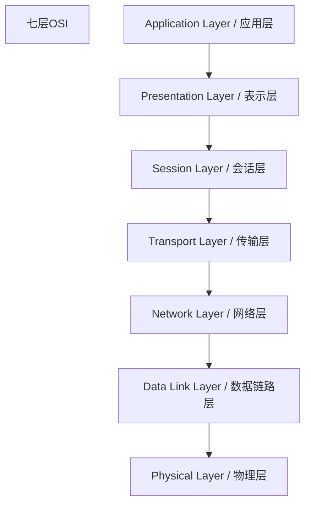
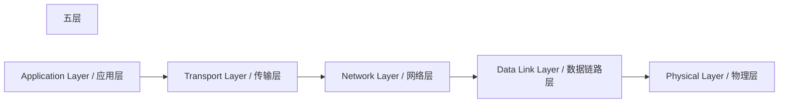
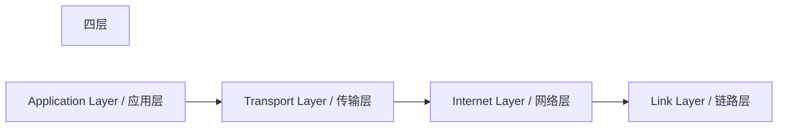

> [!TIP]
> 第一层都是应用层
> 最后一层都是物理层(链路层)

以下是对七层OSI模型、五层和四层网络模型的简单介绍。

### 七层OSI模型

OSI模型（Open Systems Interconnection Model）是一个概念框架，用于标准化计算机网络通信功能。它将网络通信分为七个不同的层，每一层都有特定的功能和协议。

1. **应用层 (Application Layer)**: 提供网络服务给应用程序，例如HTTP、FTP、SMTP等。
2. **表示层 (Presentation Layer)**: 负责数据的格式化、加密和解密，例如JPEG、MPEG等。
3. **会话层 (Session Layer)**: 管理和控制会话，包括建立、管理和终止会话，例如NetBIOS。
4. **传输层 (Transport Layer)**: 提供可靠的传输和错误恢复，例如TCP、UDP。
5. **网络层 (Network Layer)**: 负责数据包的路径选择和转发，例如IP。
6. **数据链路层 (Data Link Layer)**: 负责节点到节点的数据传输和错误检测，例如以太网、PPP。
7. **物理层 (Physical Layer)**: 负责物理介质上的比特传输，例如电缆、光纤。

### 五层网络模型

五层网络模型是对OSI模型的简化，主要用于教学和实际应用中。它将OSI模型的七层简化为五层。

1. **应用层 (Application Layer)**: 提供网络服务给应用程序。
2. **传输层 (Transport Layer)**: 提供端到端的通信和错误恢复。
3. **网络层 (Network Layer)**: 负责数据包的路径选择和转发。
4. **数据链路层 (Data Link Layer)**: 负责节点到节点的数据传输和错误检测。
5. **物理层 (Physical Layer)**: 负责物理介质上的比特传输。

### 四层网络模型

四层网络模型（也称为TCP/IP模型）是实际应用中广泛使用的网络模型。它将网络功能分为四层，每一层对应于TCP/IP协议栈中的特定功能。

1. **应用层 (Application Layer)**: 包括应用程序通信所需的所有协议和方法，例如HTTP、FTP、SMTP等。
2. **传输层 (Transport Layer)**: 提供端到端的通信服务，例如TCP、UDP。
3. **互联网层 (Internet Layer)**: 负责数据包的路径选择和转发，例如IP。
4. **链路层 (Link Layer)**: 包括所有用于在物理网络上传输数据的协议，例如以太网、Wi-Fi。

这些模型帮助标准化和简化了网络通信，使不同厂商的设备和软件能够互操作，从而促进了互联网的发展和普及。