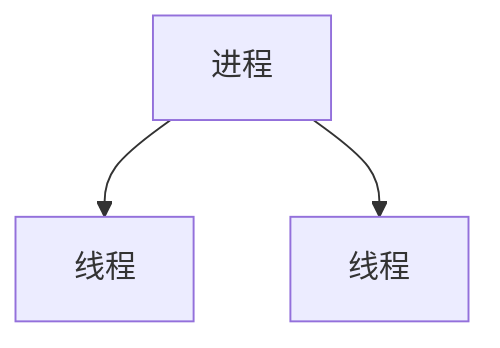

进程和线程都是计算机科学中重要的概念，用于管理程序的执行。 

1. **进程**:
   - 进程是程序在执行过程中的一个实例。它包含了程序的代码、数据以及程序执行时所需的系统资源。
   - 每个进程都有自己独立的内存空间，使得进程之间相互隔离，一个进程的崩溃通常不会影响其他进程。
   - 每个进程都有一个唯一的进程标识符（PID），用于系统识别和管理。
   - 进程之间通过进程间通信（IPC）进行数据交换。

2. **线程**:
   - 线程是进程内的一个执行单元，可以看作是轻量级的进程。一个进程可以包含多个线程。
   - 所有线程共享同一个进程的地址空间和系统资源，包括内存、文件等。
   - 线程之间的切换比进程之间的切换更快速，因为线程共享相同的上下文。
   - 线程的创建、销毁和切换开销较小，适合用于需要频繁进行任务切换的场景。

总的来说，进程和线程都是用于执行程序的基本单位，但它们在资源管理、通信和执行特性等方面有所不同。
